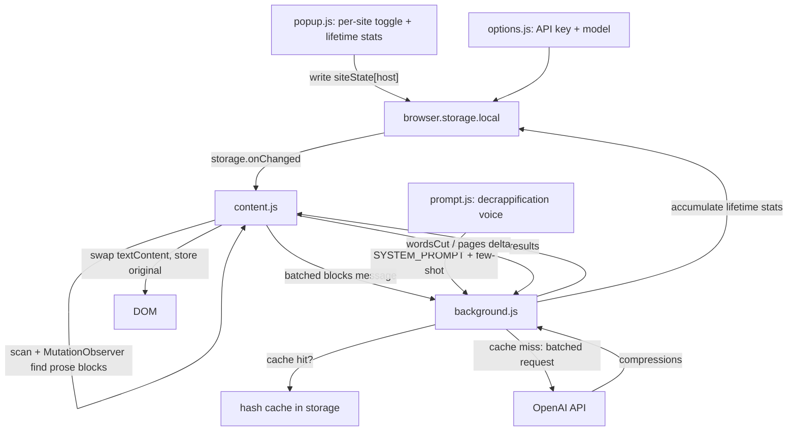

# Cut the Crap — refined architecture

A Manifest V3 browser extension (Firefox-first, Chrome-portable) that replaces bloated, jargon-heavy prose on any page with the one honest sentence it was trying to say. Per-site on/off, batched OpenAI calls, seamless in-place swap, lifetime stats only.

## Locked decisions
- Batch many blocks per OpenAI request (queue of batches, small concurrency cap).
- Firefox-first, `browser.*` + `webextension-polyfill` so Chrome works with minimal change.
- Seamless replacement: original returns only on toggle OFF or reload (no hover reveal).
- Works on any site: general prose-detection heuristic, not site-specific selectors.

## What "any text on any site" actually entails
This is the crux. A literal "any 150+ char text node" rule breaks pages. The content script must:

1. **Detect prose blocks, not raw text nodes.** Select *leaf block-level elements* (`p, li, blockquote, h1-h6, dd, figcaption`, plus `div`/`span` that contain no child block elements) whose `innerText` length >= 150. "Leaf block" = the element has no block-level element children, so we grab a paragraph, never a giant wrapping container.
2. **Hard exclusions (never touch):**
   - Editable content: `[contenteditable]`, `textarea`, `input` — never rewrite what the user is typing.
   - Code/verbatim: `pre`, `code`, `kbd`, `samp`.
   - Non-content: `script`, `style`, `noscript`, `nav`, elements with `display:none`/`visibility:hidden` (via `offsetParent`/`getClientRects`).
   - Already-processed nodes (marked with a `data-ctc` attribute).
3. **Reversible, format-safe swap.** Store each element's original `innerHTML` in a `Map<Element,string>` (strong refs, released on navigation) and set `element.textContent = compressed`. On toggle OFF, restore `innerHTML` from the map. (Seamless mode means inline formatting/links inside a compressed block are intentionally dropped until restore — acceptable since we collapse to one sentence.)
4. **Dynamic pages (SPAs, infinite scroll).** A one-time scan misses lazily loaded content. Use a `MutationObserver` to catch new blocks. Critical: **disconnect the observer (or set a writing flag) while we swap text**, or our own writes re-trigger it in a loop.
5. **Cost/perf guardrails for big pages.** A news article or wiki can have 50+ blocks. Cap at ~100 blocks/page, batch, and cap concurrency (below).
6. **Privacy note.** "Any site" means page text goes to OpenAI. Per-site default-OFF is the mitigation; document this and never run on a site the user hasn't turned on.

## Batching + rate control
- Collect eligible blocks, chunk into batches of ~6-8, send with a concurrency cap of ~3 in-flight.
- One OpenAI request per batch: system prompt + a JSON array of block texts in, JSON array of compressions out. Each batch resolves -> swap those blocks (page updates progressively, batch by batch).
- **Session + persistent cache**: key = hash(model + text) -> compression, stored in-memory for the session and mirrored to `browser.storage.local`. Re-running the demo on the same feed is instant and free.

## The decrappification voice (`prompt.js`)
The "funny voice" is the actual product, so it lives in its own module — not inlined in API logic — as the team's iteration surface. At runtime it becomes the OpenAI payload's `system` message; at source time it's one editable file.
- `prompt.js` exports `SYSTEM_PROMPT` (a short style directive + 3-6 illustrative `input -> output` example lines embedded *inside* the system string). `background.js` imports it and builds `[{role:'system', content: SYSTEM_PROMPT}, {role:'user', content: batchJSON}]`.
- **Few-shot > rule essay:** a handful of sharp before/after examples control humor far better than paragraphs of instructions. Steer the team toward adding examples.
- **Batch-format contract:** examples go *inside* the system prompt as `input -> output` lines (not as separate few-shot message turns), so they don't conflict with the JSON-array-in / JSON-array-out user message.
- **Behavioral guard:** directive includes "if the text is already concise/honest, return it unchanged" so genuine content isn't mangled.
- **Optional later (not day-one):** export a `PERSONAS` map (`deadpan`, `brutally_honest`, `sarcastic`) with a default selection, so a popup persona picker could be added for a "change the vibe live" demo moment.

## Data flow

## Files
- `manifest.json` — MV3. Firefox uses `background.scripts` (event page); a small note/second manifest or build step for Chrome's `background.service_worker`. `host_permissions` for `https://api.openai.com/*`, `permissions: [storage, activeTab, scripting]`, `browser_specific_settings.gecko.id`.
- `content.js` — prose detection, MutationObserver, reversible swap, per-site activation via `storage.onChanged`, computes word deltas.
- `prompt.js` — the decrappification voice: `SYSTEM_PROMPT` + embedded few-shot examples (and future `PERSONAS`). Imported by `background.js`. Team's main iteration surface.
- `background.js` — OpenAI batched calls (CORS-free from background with host permission), imports voice from `prompt.js`, cache, lifetime-stats accumulation, error isolation (one batch failing leaves those blocks untouched).
- `popup.html` / `popup.js` — per-site toggle (default OFF), lifetime stats (words cut, pages processed, overall % shorter). Turning ON with no API key -> `runtime.openOptionsPage()`.
- `options.html` / `options.js` — OpenAI API key + model (default `gpt-4o-mini`).
- `lib/browser-polyfill.js` — vendored `webextension-polyfill`.
- `README.md` — load/run/demo instructions (replaces current placeholder).

## Error handling
- No API key -> toggle prompts to options page, no silent failure.
- One batch's request fails (network/429/parse) -> those blocks stay original, other batches keep going. No single point of failure mid-demo.
- Malformed model output (array length mismatch) -> skip that batch's swaps rather than mis-assign text.

## Stats definition
- `wordsBefore`/`wordsAfter` counted in `content.js` per block; send deltas to `background.js` to accumulate `totalWordsCut`, `totalPagesProcessed` (+1 per page activation), and derive overall `% shorter` from cumulative before/after totals.

## Build todos
1. `manifest.json` — MV3, Firefox `background.scripts` + gecko id, host_permissions for OpenAI, storage/activeTab/scripting perms; vendor webextension-polyfill; note Chrome `service_worker` variant.
2. `options.html`/`options.js` — OpenAI API key + model field (default `gpt-4o-mini`), persisted to `browser.storage.local`.
3. `prompt.js` — decrappification voice module (`SYSTEM_PROMPT` with embedded `input -> output` few-shot examples, structured for future `PERSONAS`).
4. `background.js` — imports voice from `prompt.js`, batched OpenAI requests, session+persistent hash cache, concurrency cap, per-batch error isolation, lifetime-stats accumulation.
5. `content.js` prose detection — leaf-block heuristic (>=150 chars), hard exclusions (editable/code/nav/hidden), MutationObserver with write-guard, block cap.
6. `content.js` reversible swap — store original innerHTML in a Map, set textContent to compression, per-site activation via `storage.onChanged`, restore on OFF, compute word deltas.
7. `popup.html`/`popup.js` — per-site toggle (default OFF, no API key -> `openOptionsPage`), lifetime stats display.
8. `README` + manual test on a LinkedIn post and one non-LinkedIn article (SPA + static).
